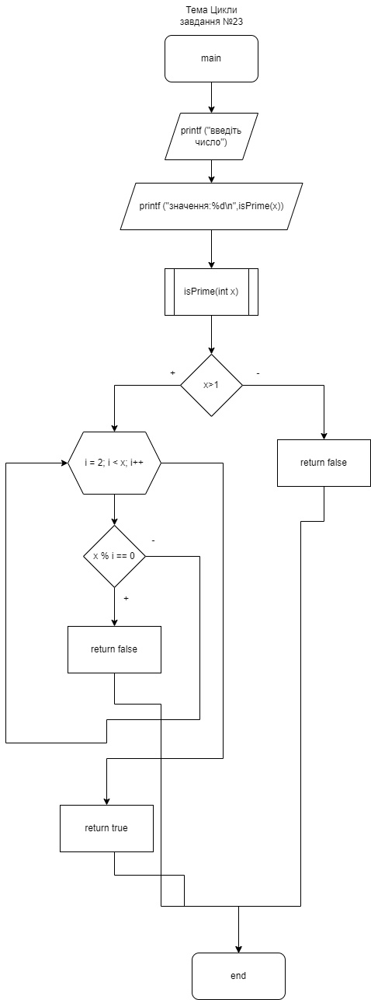
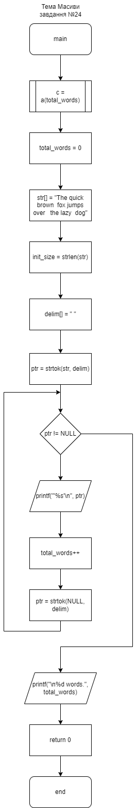

# Лабораторна №8. "Основи документування"

**Розробник**: Давидов В.В.

**Виконавець**: Болотська М.С.

**Завадання**:Розробка звітів для лабораторної роботи "Функції", що присвячена фцнкціям у двох форматах (+їх репрезентація у PDF форматі)

## Опис програми:

### Функціональне призначення: Програма призначеня для визначення чи є число простим.

### Призначення та опис структури розроблених методів констант та змінних функції

`int isPrime(int x)`

Функція, яка перевіряє чи х просте число 
 

`int  main ()`

Точка входу в програму лабораторної №7
 

**Опис функцій**

  int main ()

Точка входу в програму.

Повертає
    код помилки (0) 


**Аргументи**

- true=0 перша змінна
- false=1 друга змінна
- int isPrime(int x) функція, яка перевіряє чи х просте число 
- int x змінна х





### Структура програми:  
```
.
├── doc
│   ├── assets
│   │   ├── arrays.png
│   │   ├── bsa.drawio
│   │   └── cycles.png
│   ├── lab08.docx
│   ├── lab08.md
│   └── lab08.pdf
├── Doxyfile
├── Makefile
├── README.md
└── src
    └── main.c
```

## Вариант використання:

- введені числа мають бути позитивними
- результат роботи програми можна побачити у відлагольнику

```
Process 25874 launched: '/home/maria/programing-bolotska/lab07/src/main.bin' (x86_64)
введіть число:12
значення:1

```
### Висновок

Засвоїла основи документування коду за допомогою Doxygen
